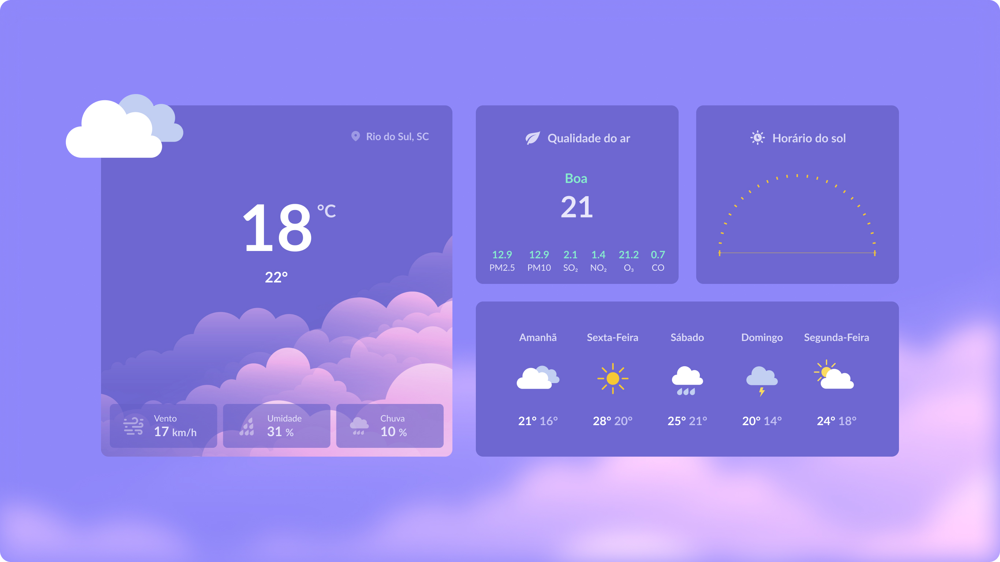

<h1 align="center"> Página de Clima  </h1>

Esse projeto foi elaborado pelo prograama Rocketseat para ensino de tecnologias WEB que tive a satisfação de concluir o projeto com sucesso!  

  <a href="#-tecnologias">Tecnologias</a>&nbsp;&nbsp;&nbsp;|&nbsp;&nbsp;&nbsp;
  <a href="#-projeto">Projeto</a>&nbsp;&nbsp;&nbsp;|&nbsp;&nbsp;&nbsp;
  <a href="#-layout">Layout</a>&nbsp;&nbsp;&nbsp;|&nbsp;&nbsp;&nbsp;
  <a href="#memo-licença">Licença</a>

  

 

  

## 🚀 Tecnologias

Esse projeto foi desenvolvido com as seguintes tecnologias:

- HTML e CSS
- Figma
- Git e Github

## 💻 Projeto

Inicialmenete, o Projeto de Previsão do Tempo foi feito com o objetivo de estudar e colocar em pratica conhecimento adquiridos com HTML e CSS. Posteriormente com o objetivo de integrar com uma API.

## 🔖 Layout

Você pode visualizar o layout do projeto através [DESSE LINK](https://www.figma.com/file/iF5r5SCL4yeAdHNrMbK2PF/Previs%C3%A3o-do-Tempo?node-id=0-1&t=OEb7hqvUF2Y04iVb-0). É necessário ter conta no [Figma](https://figma.com) para acessá-lo.

## Licença

Esse projeto está sob a licença MIT.

---